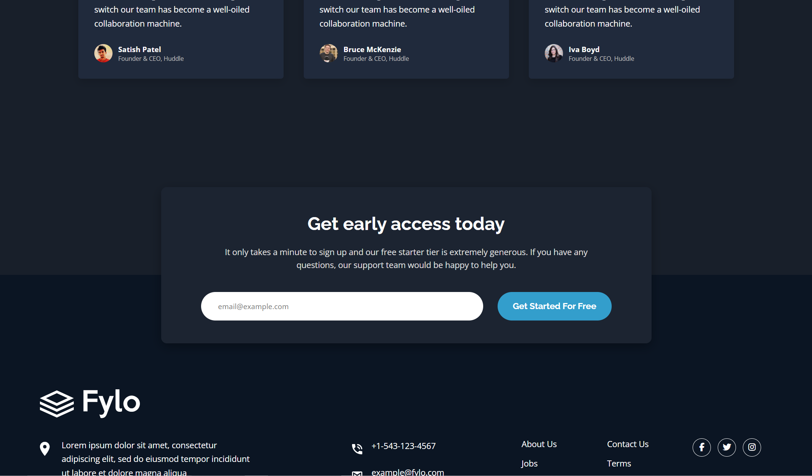
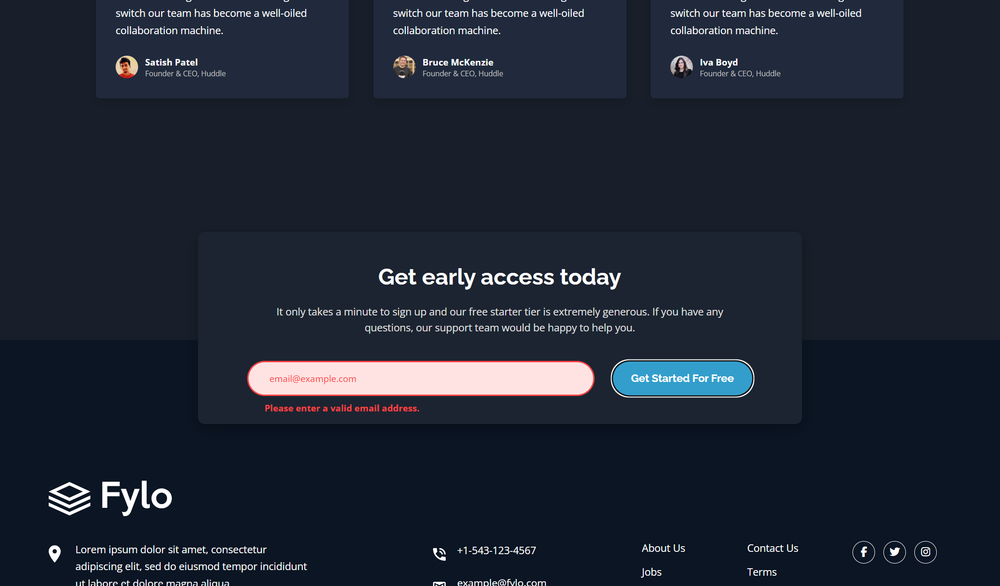
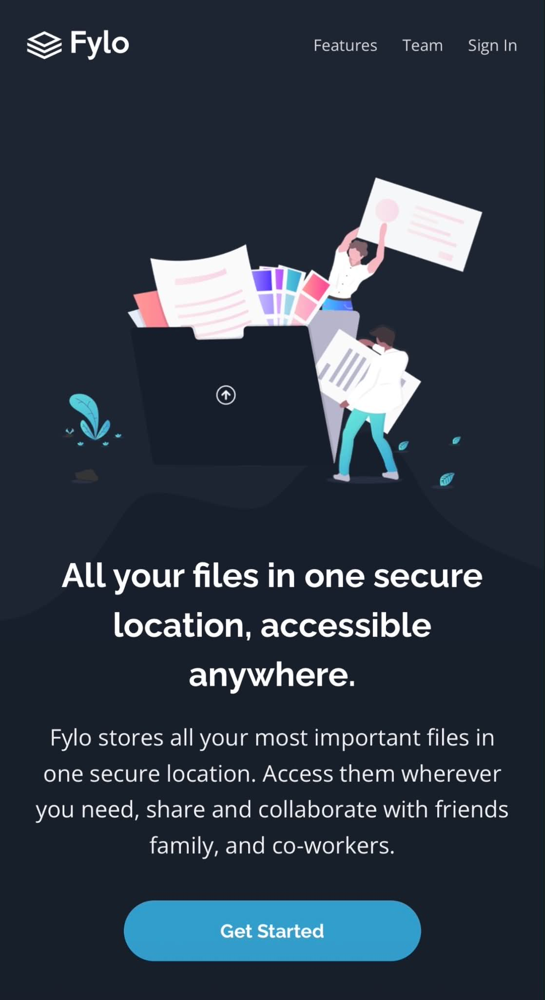
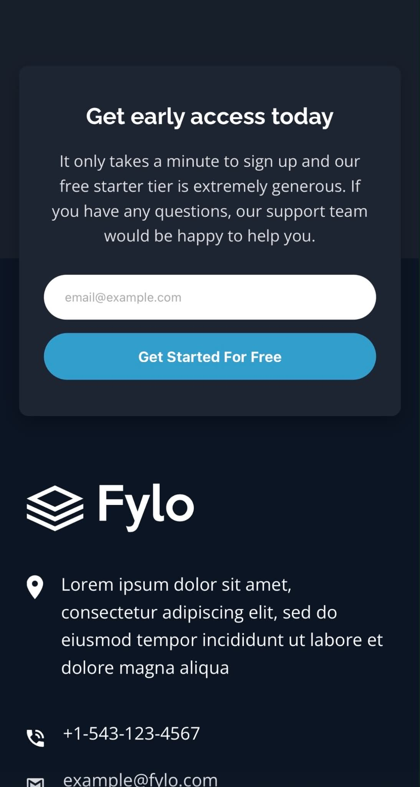
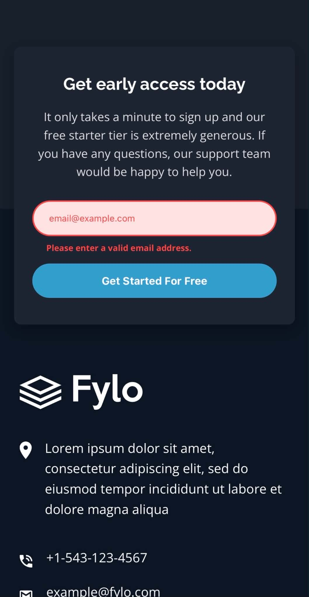

# Frontend Mentor - Fylo dark theme landing page solution

This is a solution to the [Fylo dark theme landing page challenge on Frontend Mentor](https://www.frontendmentor.io/challenges/fylo-dark-theme-landing-page-5ca5f2d21e82137ec91a50fd). Frontend Mentor challenges help you improve your coding skills by building realistic projects. 

## Table of contents

- [Overview](#overview)
  - [The challenge](#the-challenge)
  - [Screenshot](#screenshot)
  - [Links](#links)
- [My process](#my-process)
  - [Built with](#built-with)
  - [What I learned](#what-i-learned)
  - [Continued development](#continued-development)
  - [Useful resources](#useful-resources)
  - [AI Collaboration](#ai-collaboration)
- [Author](#author)

## Overview

### The challenge

Users should be able to:

- View the optimal layout for the site depending on their device's screen size
- See hover states for all interactive elements on the page

### Screenshot

### Links

- Solution URL: [Add solution URL here](https://your-solution-url.com)
- Live Site URL: [Add live site URL here](https://your-live-site-url.com)

## My process

### Built with

- Semantic HTML5 markup
- CSS custom properties
- Flexbox
- CSS Grid
- Mobile-first workflow

### What I learned

Still getting used to and learning how to properly style navigation bars. I am still seeing myself refer to StackOverflow for assistance in this area, I will continue to do these projects that have these navigation menus so that I can fully get an understanding and to gain more knowledge in this area. I seemed to have struggled quite a bit with the curve image being ontop of the intro illustration, for this part I did need help with Ai and even then it proved to be difficult to get this correct, Ai was giving me all sorts of code which didn't seem right or when testing it pushed the images further from the design. In the end I got a rough estimate of how this is supposed to look. I used grid for the "features" section as well as the "testimony" section. This helped when doing the tablet and desktop layouts for the webpage later on.

### Continued development

As I am still getting used to designing navigation layouts and menus, I will continue to do projects that involve these so that I can improve my skills and knowledge in this area. I will also continue doing projects that contain JavaScript as I am still learning in this area too and want to improve in this area also.

### Useful resources

- StackOverflow is still my reference guide when needing assistance in areas that I am unfamiliar with.

### AI Collaboration

I used ChatGPT for debugging some areas of my code, though most of the time it proved unuseful, but there were times where I was able to get a correct answer with a solution and an explanation on why, what and how.

## Author

- Website - [Christopher Gorrey - Portfolio](https://khriz93.github.io/Portfolio-Webpage/)
- Frontend Mentor - [@Khriz93](https://www.frontendmentor.io/profile/Khriz93)
